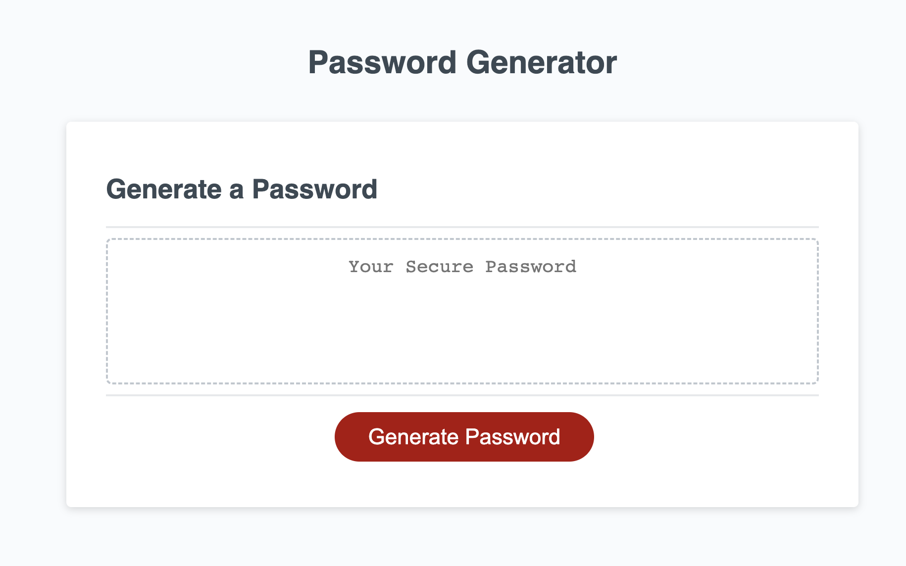
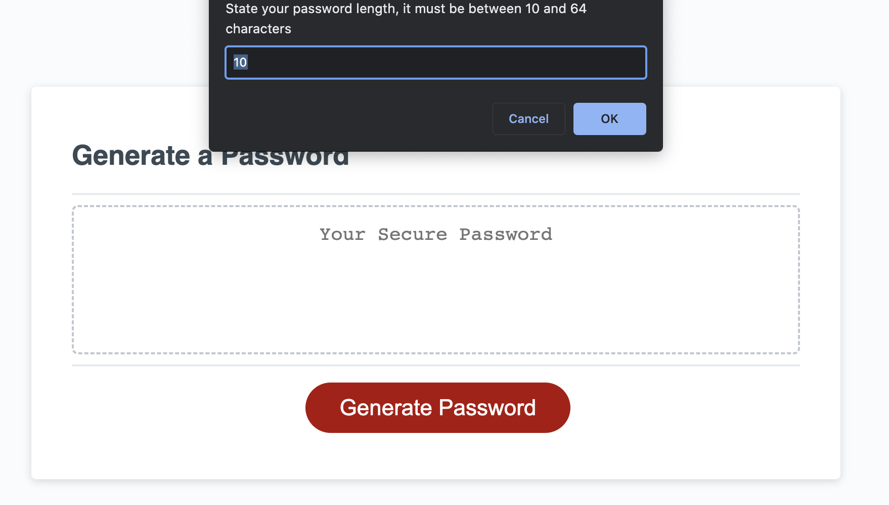
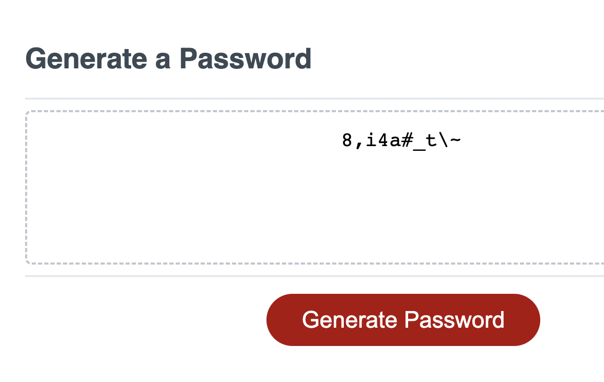

# wk5-password-generator
Advanced Javascript unit 5 Challenge - create a password generator

## Description
We have learnt more advanced JavaScript and are now applying this to create a password generator

## Table of Contents

* [Deployed Page](#deployed-page)
* [Process](#process)
* [Additional Notes](#additional-notes)
* [Credits](#credits)
* [License](#license)

# Deployed Page

* [Deployed Page Link](https://lilibear1.github.io/wk5-password-generator/)

    

* [Git Page Link](https://github.com/LiliBear1/wk5-password-generator) 

## Process

This website is to display advanced JavaScript Skills. When the user clicks the "Generate Password" button, they will receive a series of prompts. 

The user will be able to select a password length of 10-64 characters and can choose to have a combination of Lowercase, Uppercase, Numeric and special characters.

## Additional notes

I used a combination of objects, arrays, functions, for loops, while and if statements as well as learnt how to call and return functions as well as various operators and math functions.

The biggest challenge I faced was data fatigue, it becomes very easy to miss things when you stare at a page of code too long, there is a large amount of information on the internet which can become overwhelming, but stepping away from the laptop and coming back always helped.

## Credits 
2022 Trilogy Education Services, LLC

## License

An [MIT license](https://choosealicense.com/licenses/mit/) was used.